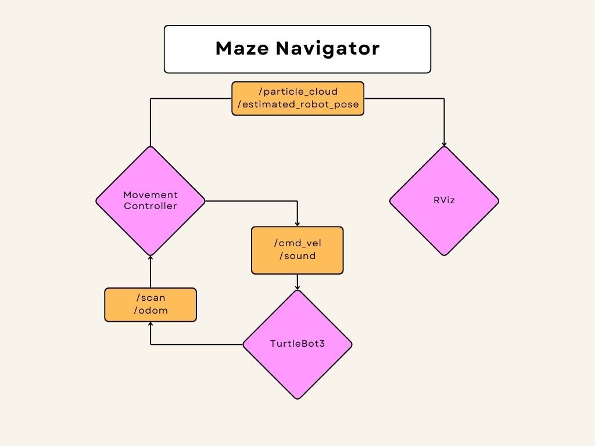

# A* Maze Navigation

**Names:** Maxwell Krolak, Tejas Narayan, Justin Shin

## Project Description

Our project aimed to extend our particle filter localization to enable a robot
to not only identify its position but also navigate to arbitrary other points in
the provided maze. With a combination of informed pathfinding and localization,
our goal was to have the robot move to a provided location. The robot scans its
surroundings, relaying them to a ROS node that determines its location and
issues movement commands to get it to its destination. The latest submission is
largely successful in this, navigating the maze with minimal collision and
efficient routes.

## System Architecture

We used two different approaches to navigate through the maze, which we will
refer to as the **gradient** method and the
**parametric** method.

### Particle filter optimization

Because navigating the maze required live positional updates from the robot, our
particle filter needed to be both fast and precise in order to provide motion
commands in real time. We built on the particle filter project (which was
already heavily optimized) in order to make this project work. All or most of
these changes happened in `particle_filter.py`.

- Further vectorization, particularly in `measurement_model()`, through numpy
- Distinguishing "deep scans" for initialization from "quick scans" to be
used in real time
- Increased map resolution to account for very small variations in position
- Optimized particle cloud initialization by precomputing a valid
coordinate set rather than randomizing and then filtering for validity
- Motion model now accounts for backward movement (more of a bug fix, but
still)

### Pathfinding

Once the robot has determined its position in the maze, we use the map to
determine the shortest safe route to its destination. To do this, we implemented
Dijkstra's algorithm on the maze's coordinate grid to find the shortest path
from any location to the destination. By excluding points close to the walls of
the maze, we could somewhat account for the size of the robot and eliminate
paths likely to cause collisions.

Though A* would somewhat optimize this process by only searching part of the
maze, we computed all optimal paths for three reasons: ease of implementation,
built-in error handling, and to remove the need for recomputation.

This is where the solutions we applied start to diverge. The logic for both can
be found in `path_finder.py`.

#### Gradient

In the gradient method, we used the entire shortest paths tree to determine the
best new node to go to from *any point in the graph*. This solution didn't
decide on a path to the destination before the robot started moving; it just
determined the next best action one step at a time given the state of the robot
and the maze layout.

#### Parametric

In our parametric movement model, we relied on a precomputed path derived from
the Dijkstra tree. We originally intended to compute this path with A*, but the
performance drop from computing the full tree was negligible, so we chose to
reuse that logic; despite our project goal, we ironically never implemented A*
(though the path we found wouldn't have changed if we had).

### Path modification

After computing a path through the maze, we applied some transformations on it
before applying to to the robot's motion in order to simplify movement planning
and execution. Because the LiDAR only gives us five scans per second, the rate
at which we can tell the robot to update its velocity is limited to 5Hz. This
means that the less frequently we need to issue movement updates, the more
reliably the robot will follow the provided path. Both solutions handle this
in `path_finder.py`.

#### Gradient

Because there was no precomputed path, all path modifications took place in real
time. From the robot's current position as determined by the particle filter,
we charted out the optimal path until it turned. Approximating that section of
the path as a line segment, we were able to skip many of the intermediate nodes
and target the later ones with negligible impact on the route.

#### Parametric

This solution uses a series of points to chart out a path from the initial to
the final position, then parameterizes the robot's movement along that sequence.
Originally, we handled this as a piecewise function composed of linear segments,
which we approximated from the A* path using Douglas-Peucker. Later, we fit
B-splines to the path in order to eliminate the jerky movement that comes from
advancing, turning, and then advancing again. Though our demo only used the
latter, our final submission uses both Douglas-Peucker reduction and
curve-fitting, which we found to give more reliable results.

### Movement

Once the robot was in the maze, we had to continuously issue commands based on
its last known position and our knowledge of the layout. Despite our best
efforts, the robot would occasionally veer too close to a wall, meaning that our
movement strategies had to be designed around collision avoidance and recovery.
This code can be found in `motion.py`.

#### Gradient

The advantage to this approach was that even if the robot strayed from the
optimal path, the logic for determining its next movement was identical, since
we had already precomputed the best *next step* from any position in the maze.
The exception to this was the out-of-bounds "dead zones" we defined, where the
robot would be close enough to the wall that it would either have already
crashed or be at risk of doing so. If the robot finds itself in these areas,
our solution prioritizes moving it back into valid territory before resuming the
normal control flow.

#### Parametric

After a path was computed and parameterized, the robot's best guess of what a
collision-free route might look like was that path. As a result, we wanted to
nudge the robot toward the path while allowing for some uncertainty in the
localization. We achieved this by computing the robot's velocity at any point as 
the sum of the tangent vector to the path near its position and a corrective
component vector based on the distance from the path. We experimented with
different weights and scalings for these components before settling on the
linear scalings we currently use. Unlike the gradient method, this solution
will not backtrack in case of a collision; it will just continue to try and
merge with the path.

### Buzzer

When the robot reaches its destination, its buzzer plays a jingle to announce
that it's arrived. While this wasn't strictly necessary to achieve our initial
goals, it was a fun exercise in poking around the robot's error reporting to
tell it to announce "catastrophic failure" whenever it succeeded.

## ROS Node Diagram

## Execution

1. In a terminal window, run
`roslaunch astar_project visualize_particles.launch`.
2. In a second window, run `rosrun astar_project particle_filter.py`.
3. The demo should run. It chooses a location in the maze and navigates to it,
then repeats, alternating between gradient and parametric navigation for each
new destination.

## Challenges

A challenge we *didn't* have (but were anticipating) was difficulty syncing the
robot's localization with movement commands. We preemptively optimized the
particle filter to deal with this issue, so it's possible we resolved it before
it ever had the chance to affect our progress.

Our main concern was collisions. Because the robot didn't obey our directions to
the letter and because our safe zones were determined based on a slightly
inaccurate model of the robot's size and shape, most of our time was spent
ensuring that the robot wouldn't clip a wall and get stuck.

## Future Work

Most of our stretch goals for this project—a traveling salesman solution,
multi-agent pathfinding, reduced network dependency, a user-friendly
interface—unfortunately weren't feasible in the timeframe we had, since the
first two wouldn't work without a high degree of reliability in maze navigation
while the last two were simply lower priority. Given more time, though, we would
try to tackle these goals to smooth out and extend the work we've already done.
We would also have liked to refactor our work so that the particle filter and
movement controller ran in separate nodes; as of right now, they don't, though
the logic is handled in separate python files.

## Takeaways

A lot of these were things we'd suspected that were hammered home while working
on this project

- When in doubt, NumPy will probably fix your problem. Either it'll speed up
your logic by several orders of magnitude or it has a ready-made solution that
does exactly the thing you need.

- Moving parts introduce uncertainty. Motors are inherently unpredictable. If
you need something precise from one, then check its work frequently.
- Git branches are a useful way to ensure that one feature can be developed and
tested without interference. We learned this lesson the hard way every time our
robot crashed during the demo.
